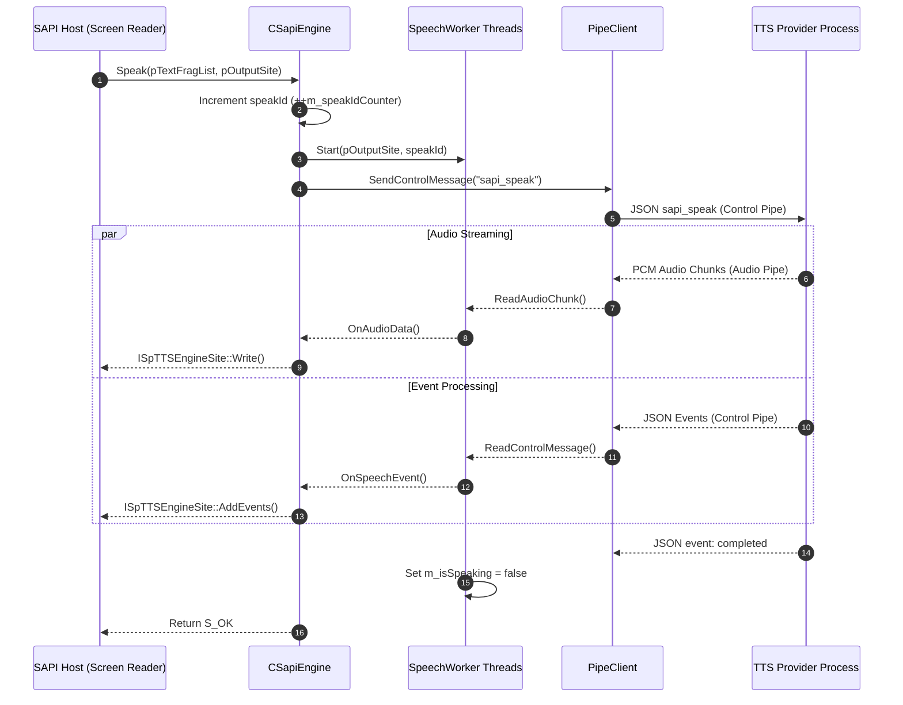
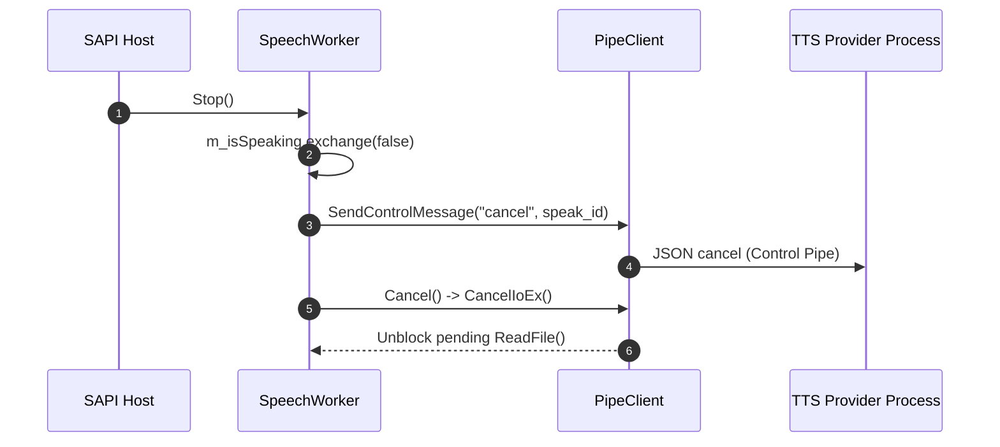
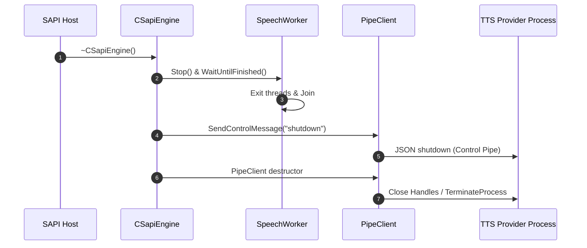

# CoreEngine C++ Technical Reference

`CoreEngine.dll` is the unmanaged C++ COM proxy component of the **Modern SAPI Adapter**. It implements standard Windows Speech API (SAPI 5) engine interfaces (`ISpTTSEngine`, `ISpObjectWithToken`) and translates COM speech synthesis requests into out-of-process JSON messages over Dual Named Pipes.

This document details the C++ class architecture, COM registration entry points, method APIs, thread lifecycle management, overlapped I/O mechanics, asynchronous event translation, and exception safety boundaries.

---

## Component Overview & COM Architecture

`CoreEngine.dll` is compiled as a strict 64-bit (`x64` / `ARM64`) C++20 dynamic link library utilizing C++/WinRT and WIL (Windows Implementation Library).

### COM Identifiers

| Identifier | Value | Description |
| :--- | :--- | :--- |
| **Target Platform** | Windows 11 (x64, ARM64) | Strict 64-bit architecture |
| **Output Binary** | `CoreEngine.dll` | In-process SAPI 5 engine proxy DLL |
| **CLSID Constant** | `CLSID_SapiEngine` | `{91CD243C-63F7-441F-AE2F-45057005CB6D}` |
| **CLSID String** | `SapiEngineClsidString` | `"{91CD243C-63F7-441F-AE2F-45057005CB6D}"` |
| **Language Standard** | C++20 (`stdcpp20`) | ISO C++20 |

### COM Registration & Entry Points

`dllmain.cpp` exports standard unmanaged COM DLL entry points defined in `CoreEngine.def`:

- `DllGetClassObject`: Instantiates `SapiEngineClassFactory` for `CLSID_SapiEngine`.
- `DllCanUnloadNow`: Evaluates active object locks, returning `S_OK` when no COM references remain.
- `DllRegisterServer`: Registers `CLSID_SapiEngine` under `HKEY_CLASSES_ROOT\CLSID\`.
- `DllUnregisterServer`: Removes `CLSID_SapiEngine` registry keys upon uninstallation.

---

## Core Class Reference

### `CSapiEngine`

`CSapiEngine` is the primary COM class implementing `ISpTTSEngine` and `ISpObjectWithToken` using C++/WinRT (`winrt::implements`).

```cpp
IFACEMETHODIMP SetObjectToken(ISpObjectToken* pToken) noexcept override;
```
Associates a SAPI 5 object token with the engine. Reads `ProviderExecutablePath`, `ProviderPipeName`, and `VoiceId` from the token interface, instantiates `PipeClient`, connects named pipes, and sends an `info` command to negotiate audio format parameters.

```cpp
IFACEMETHODIMP GetObjectToken(ISpObjectToken** ppToken) noexcept override;
```
Retrieves the active `ISpObjectToken` pointer currently bound to the engine instance.

```cpp
IFACEMETHODIMP GetOutputFormat(
    const GUID* pTargetFmtId,
    const WAVEFORMATEX* pTargetWaveFormatEx,
    GUID* pOutputFormatId,
    WAVEFORMATEX** ppCoMemOutputWaveFormatEx) noexcept override;
```
Returns the `WAVEFORMATEX` audio format structure negotiated with the provider during initialization (default: 24,000 Hz, 16-bit Mono PCM).

```cpp
IFACEMETHODIMP Speak(
    DWORD dwSpeakFlags,
    REFGUID rguidFormatId,
    const WAVEFORMATEX* pWaveFormatEx,
    const SPVTEXTFRAG* pTextFragList,
    ISpTTSEngineSite* pOutputSite) noexcept override;
```
Translates a linked list of SAPI text fragments (`SPVTEXTFRAG`) into a structured `sapi_speak` JSON request, automatically assigns an incremental `speak_id` (`m_speakIdCounter`) and `voice_id` (`m_voiceId`), invokes `m_pWorker->Start(pOutputSite, speakId)` to initialize speech tracking, transmits the payload over the Control Pipe, and performs synchronous waiting (`WaitUntilFinished()`) if `SPF_ASYNC` is omitted.

```cpp
bool OnAudioData(const uint8_t* pAudioBytes, uint32_t byteCount);
```
Writes raw PCM audio buffers to the output site (`ISpTTSEngineSite::Write`). Protected by `m_siteMutex`.

```cpp
void OnSpeechEvent(const winrt::Windows::Data::Json::JsonObject& eventJson);
```
Parses incoming JSON event payloads and converts them into native SAPI 5 `SPEVENT` structures. Checks `eventSpeakId == m_speakIdCounter` to discard stale events from previous utterances.

---

### `SpeechWorker`

`SpeechWorker` manages background audio streaming and control event processing across two dedicated worker threads.

```cpp
void AudioThreadProc();
```
Loop executing on `m_audioThread`. Initializes a WinRT multi-threaded apartment (`winrt::init_apartment`), calls `ReadAudioChunk`, and forwards raw PCM bytes to `CSapiEngine::OnAudioData`.

```cpp
void ControlThreadProc();
```
Loop executing on `m_controlThread`. Initializes a WinRT multi-threaded apartment, calls `ReadControlMessage`, verifies `speak_id` matching `m_activeSpeakId.load()`, updates internal speaking state on `completed` or `error` (`error`/`fatal` severity) events, and dispatches JSON events to `CSapiEngine::OnSpeechEvent`. Wrapped in `try/catch(winrt::hresult_error)` to prevent unhandled WinRT exceptions from crashing the host process.

```cpp
void Start(void* pSite, uint64_t speakId);
```
Initializes active `speak_id` tracking (`m_activeSpeakId`) and sets `m_isSpeaking = true`.

```cpp
void Stop();
```
Atomically evaluates and clears speaking state via `m_isSpeaking.exchange(false)`, sends a `cancel` JSON command with the active `speak_id` over the Control Pipe, and handles WinRT exception guards.

```cpp
void WaitUntilFinished();
```
Blocks the calling thread until speech synthesis finishes or cancellation is requested (used for synchronous `Speak` calls).

---

### `PipeClient`

`PipeClient` manages out-of-process Dual Named Pipe connections and provider process execution.

```cpp
HRESULT Connect(const std::wstring& pipeName, const std::wstring& exePath);
```
Constructs user-isolated named pipe paths (`\\.\pipe\<pipeName>\<UserSID>\control` and `audio`). Connects directly if the provider is active; otherwise spawns the provider via `CreateProcessW` and waits for pipe servers to initialize.

```cpp
HRESULT SendControlMessage(const winrt::Windows::Data::Json::JsonObject& json);
```
Serializes a `JsonObject` to a newline-terminated UTF-8 string and performs an overlapped `WriteFile` operation on the Control Pipe.

```cpp
HRESULT ReadControlMessage(winrt::Windows::Data::Json::JsonObject& outJson);
```
Performs overlapped `ReadFile` operations on the Control Pipe, accumulating chunks until a newline (`\n`) is encountered, then parses the JSON payload.

```cpp
HRESULT ReadAudioChunk(std::vector<uint8_t>& buffer, DWORD& bytesRead);
```
Performs an overlapped `ReadFile` operation on the Audio Pipe, filling `buffer` with raw PCM audio data.

```cpp
void Cancel();
```
Invokes `CancelIoEx` on both pipe handles to immediately abort pending overlapped I/O operations during cancellation or shutdown.

---

### `AsyncLogger`

`AsyncLogger` provides non-blocking, thread-safe diagnostic logging for `CoreEngine.dll`.

- **Function:** `void CoreLog(const wchar_t* format, ...);`
- **Output File Path:** `%LOCALAPPDATA%\ModernSapiAdapter\core_engine.log`
- **Behavior:** Formats diagnostic log messages with timestamps and appends them to the log file asynchronously.

---

## Sequence Diagrams & Concurrency Flows

### Speech Request Execution Flow



#### Step-by-Step Execution Narrative

1. **Invocation:** SAPI Host calls `CSapiEngine::Speak()`.
2. **Request Packaging:** `CSapiEngine` generates a unique `speak_id`, packages text/silence/bookmark fragments into `sapi_speak` JSON.
3. **Worker Binding:** `CSapiEngine` binds `speak_id` to `SpeechWorker::Start()` *before* transmitting over the pipe.
4. **IPC Transmission:** `PipeClient` writes `sapi_speak` to the Control Pipe.
5. **Concurrent Operations:**
   - **Audio Thread (`AudioThreadProc`):** Reads raw PCM chunks and writes to `ISpTTSEngineSite::Write()`.
   - **Control Thread (`ControlThreadProc`):** Reads JSON events (`word_boundary`, `sentence_boundary`, `bookmark_reached`), verifies `speak_id`, and posts SAPI `SPEVENT`s.
6. **Completion:** Provider sends `{"event": "completed", "speak_id": N}`. `SpeechWorker` updates state and unblocks synchronous calls.

---

### Speech Cancellation Flow



#### Step-by-Step Cancellation Narrative

1. **Cancellation Trigger:** SAPI Host calls `SpeechWorker::Stop()` (or new utterance starts).
2. **Atomic Flag Swap:** `m_isSpeaking.exchange(false)` ensures only one thread executes cancel logic.
3. **IPC Cancel Request:** Transmits `{"command": "cancel", "speak_id": N}` over Control Pipe.
4. **I/O Abort:** `PipeClient::Cancel()` calls `CancelIoEx()` on pipe handles, unblocking pending overlapped `ReadFile` calls immediately.

---

### Engine Teardown & Shutdown Flow



#### Step-by-Step Teardown Narrative

1. **COM Object Destruction:** SAPI Host releases engine instance (`CSapiEngine::~CSapiEngine()`).
2. **Thread Teardown:** Worker threads are stopped and joined cleanly.
3. **Shutdown IPC:** Emits `{"command": "shutdown"}` over Control Pipe inside a WinRT `try/catch` guard.
4. **Handle Cleanup:** Pipe handles and process handles are closed safely.

---

## SAPI Event Translation & Error Severity Handling

### SAPI Event Mapping

| Inbound JSON Event | Native SAPI `SPEVENT` | Payload Mapping |
| :--- | :--- | :--- |
| `word_boundary` | `SPEI_WORD_BOUNDARY` | `audio_offset_ms` -> `ullAudioStreamOffset`, `text_offset` -> `lParam`, `text_length` -> `wParam` |
| `sentence_boundary` | `SPEI_SENTENCE_BOUNDARY` | `audio_offset_ms` -> `ullAudioStreamOffset`, `text_offset` -> `lParam`, `text_length` -> `wParam` |
| `bookmark_reached` | `SPEI_TTS_BOOKMARK` | `audio_offset_ms` -> `ullAudioStreamOffset`, `bookmark_name` -> `CoTaskMemAlloc` string in `lParam` (`SPET_LPARAM_IS_STRING`) |
| `completed` | *N/A (Internal)* | Resets `m_isSpeaking = false` in `SpeechWorker` |
| `error` | *N/A (Diagnostic)* | Logs `message`, `severity`, `friendly_text` via `CoreLog`. Resets `m_isSpeaking = false` for `error`/`fatal` severities |

### Error Severities

| Severity | Description | CoreEngine Action |
| :--- | :--- | :--- |
| `info` | Informational diagnostic message | Logged to `CoreLog`. Synthesis continues. |
| `warning` | Non-critical warning | Logged to `CoreLog`. Synthesis continues. |
| `error` | Synthesis request failed | Logged to `CoreLog`. Speech state reset (`m_isSpeaking = false`). |
| `fatal` | Unrecoverable provider failure | Logged to `CoreLog`. Speech state reset (`m_isSpeaking = false`). |

### Stale Event Filtering

`CSapiEngine::OnSpeechEvent` and `SpeechWorker::ControlThreadProc` extract `speak_id` from inbound JSON messages and compare it against the active `speak_id`. If `eventSpeakId != m_speakIdCounter`, the event is dropped to prevent stale events from previous speech requests from polluting the current stream.

---

## Overlapped I/O & Exception Boundaries

### Overlapped I/O Rationale

Synchronous Win32 pipe operations (`ReadFile` / `WriteFile` without `OVERLAPPED`) block calling threads indefinitely. If a provider process crashes or hangs mid-sentence, synchronous pipe calls deadlock the host process forever.

By opening handles with **`FILE_FLAG_OVERLAPPED`** and passing Win32 manual-reset events (`OVERLAPPED::hEvent`), `PipeClient::Cancel()` calls `CancelIoEx`, unblocking background worker threads instantly during speech cancellation or process teardown.

### WinRT Exception Safety

C++/WinRT methods (`JsonObject`, `GetNamedString`, `Stringify`) throw `winrt::hresult_error` exceptions on failure or type mismatches (which do *not* inherit from `std::exception`).

`CoreEngine.dll` protects all internal execution loops with explicit exception handlers:
- **COM Interfaces (`SetObjectToken`, `Speak`)**: Wrapped in `noexcept try ... catch(const std::exception&)` to convert exceptions to `HRESULT` return codes.
- **Worker Thread Loop (`ControlThreadProc`)**: Wrapped in `try { ... } catch (const winrt::hresult_error& e)` and `catch (...)` to log errors and prevent thread crashes.
- **Destructor (`~CSapiEngine()`)**: Wrapped in `try { ... } catch (...)` to guarantee `noexcept` destructor safety and prevent `std::terminate()` crashes during host process exit.
